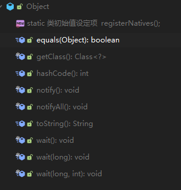

# 标准库

## 基本数据类型

| 基本类型  | 位数 | 字节 | 默认值  |
| --------- | :--- | ---- | ------- |
| `int`     | 32   | 4    | 0       |
| `short`   | 16   | 2    | 0       |
| `long`    | 64   | 8    | 0L      |
| `byte`    | 8    | 1    | 0       |
| `char`    | 16   | 2    | 'u0000' |
| `float`   | 32   | 4    | 0f      |
| `double`  | 64   | 8    | 0d      |
| `boolean` | 1    | 1    | false   |

:::warning

boolean理论上字节长度为1, 实际依赖于JVM的具体实现

:::

## 包装类型

所有基本型有对应的包装类型, 不再一一列举

基本型与包装型可自动拆箱装箱:

```java
// 装箱
Integer i = 10;
// 拆箱
int n = i;
```

部分包装类型实现了常量池:

| 常量池      | 范围              |
| ----------- | ----------------- |
| `Byte`      | [-128, 127]       |
| `Short`     | [-128, 127]       |
| `Integer`   | [-128, 127]       |
| `Long`      | [-128, 127]       |
| `Character` | [0, 127]          |
| `Boolean`   | `True`或者`False` |

:::danger

包装类型基于对象和常量池, 在比较时应使用`equals`方法

:::

## 注解

注解本质是继承了`Annotation`的接口

注解只有被解析后才会生效, 常见的解析方法有:

- 编译期扫描, 例如`@Override`
- 反射, 例如Spring的`@Component`

可以被继承的注解, 需要查看源码是否包含`@Inheritance`

## 接口与抽象类

在Java 8之后, 接口与抽象类的区别不再像以往那么明显:

| 功能                            | 接口 | 抽象类 |
| ------------------------------- | ---- | ------ |
| 定义私有属性                    | ×    | √      |
| 定义静态属性                    | √    | √      |
| 定义方法                        | √    | √      |
| 默认方法                        | √    | √      |
| 静态方法                        | √    | √      |
| 对象方法(`equals`/`hashCode`等) | ×    | √      |
| 多继承                          | √    | ×      |

示例:

```java
public interface IPerson {
    // 静态方法
    static String getName() {
        return "person";
    }
    
    //默认方法
    default Integer getSex() {
        return 1;
    }
    
    String getAddress();
}

public class Person implements IPerson {
    @Override
    public String getAddress() {
        return null;
    }
}

public class Test {
    public void test() {
        // 直接使用接口调用静态方法
        IPerson.getName();
        new Person().getSex();
    }
}
```

## 类

### Object

所有的类都继承自Object, 可以使用它的方法:



需要额外注意的是`equals`和`hashCode`

`equals`方法用于判断两个对象是否相等, Object的`equals`非常简单:

```java
public class Object {
    public boolean equals(Object obj) {
        return (this == obj);
    }
}
```

`hashCode`是`native`方法, 用来计算对象的哈希值, 哈希值会在`HashMap`等集合中使用

Java对象应注意一个原则: **当`equals`结果为`true`时, 两个对象的`hashCode`结果应相同**

:::tip

这便是为什么重写`equals`时必须重写`hashCode`

:::

### 构造方法


## IO

## 异常

