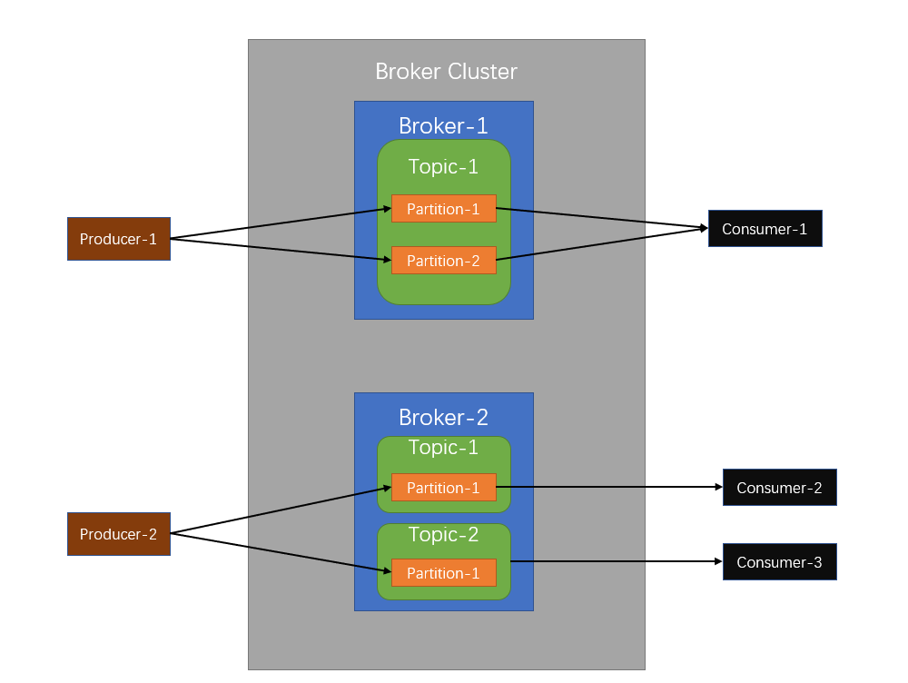

# Kafka

::: tip

本文中所有代码示例均使用[Spring for Apache Kafka](https://docs.spring.io/spring-kafka/docs/current/reference/html/)

:::

## 什么是Kafka

Kafka是一个分布式流式处理平台

流式平台有三个关键功能:

- 消息队列
- 容错的持久方式存储记录消息流: 把消息持久化到磁盘，避免消息丢失
- 流式处理: 在消息发布的时候进行处理

Kafka有两大应用场景:

- 消息队列: 建立实时流数据管道，以可靠地在系统或应用程序之间获取数据
- 数据处理: 构建实时的流数据处理程序来转换或处理数据流

Kafka相较于其它消息队列(RocketMQ/RabbitMQ)的优势:

- 性能: 基于Scala和Java开发, 设计中大量使用了批量处理和异步的思想，最高可以每秒处理千万级别的消息
- 生态: 在大数据和流计算领域与其它周边系统的兼容性最好

## 结构

- Cluster: 集群, 由多个Broker组成
- Broker: 消息代理
- Topic: 主题
- Partition: 分区, 一个Topic可以有多个Partition, 且Partition可以分布在不同的Broker上
- Replica: 副本, 一个Partition可以有多个Replica
- Producer: 生产者
- Consumer: 消费者

*Partition其实就是队列*



## 队列模型

采用发布-订阅模型


## 特性

### 多分区

Kafka为主题提供了多分区, 即一个Topic可以有多个Partition, 并且Partition可以分布在不同的Broker上

多分区特性能提供比较好的并发能力(负载均衡)

### 多副本

Kafka为分区引入了多副本, 即一个Partition可以有多个Replica

副本之间采用分布式共识算法, 分为leader和follower

多副本特性有如下优点:

- 提高消息存储的安全性
- 容灾

缺点是增加了存储空间

### ZooKeeper

Kafka的诸多功能是基于ZooKeeper实现的:

- Broker注册
- Topic注册
- 负载均衡

可以参照[官方文档](https://kafka.apache.org/)手动运行Kafka, 并使用[PrettyZoo](https://github.com/vran-dev/PrettyZoo)等可视化工具观察目录结构

 

## 容错

### 消费顺序

Kafka添加消息到分区方式如下:


如图所示, **Kafka只能保证分区中的消息有序**

Kafka在发送消息时, 可以指定主题/**分区**/**键值**/数据4个参数

同一键值的消息可以保证发送到同一分区

所以, 有如下几种保证消费顺序的方法:

- 一个主题只创建一个分区: 这种方法无法体现Kafka分区的设计初衷, 不推荐
- 发送消息时手动指定分区
- 发送消息时指定键值为表/对象/领域模型的唯一标识

### 消息丢失

生产者/消费者/Kafka都可能会出现消息丢失的情况, 有如下几种兜底策略:

- 配置生产者重试次数与重试时间
- 主题副本与最小同步副本数量
- 生产者同步发送消息
- 生产者异步发送消息兜底回调

#### 配置生产者重试次数与重试时间

```yaml
spring:
  kafka:
    producer:
      bootstrap-servers: localhost:9092
      # 重试次数
      retries: 5
      properties:
        retry:
          backoff:
            # 重试间隔, 单位毫秒
            # 
            ms: 100
```

::: tip

**重试间隔不应设置过小**, 否则网络波动稍微长一点, 重试次数就被消耗完了

:::

#### 主题副本与最小同步副本数量

开启副本机制, 增加生产者配置:

```yaml
spring:
  kafka:
    producer:
      # 在完成发送请求之前, 生产者要求leader收到follower的确认次数
      # 需要结合下文的主题配置min.insync.replicas使用
      acks: all
```

配置主题副本与最小同步副本数量, 不允许未同步副本参加选举:

```java
@Configuration
public class KafkaConfig {
  @Bean
  public NewTopic topic() {
    return TopicBuilder
      .name("houtaroy")
      // 两个分区
      .partitions(2)
      // 三个副本
      .replicas(3)
      // 最小同步副本数量, 3-1=2
      .config(TopicConfig.MIN_IN_SYNC_REPLICAS_CONFIG, "2")
      // 不允许未同步的副本参加选举
      // 默认为true, 不需要手动配置, 这里只是为了说明
      .config(TopicConfig.UNCLEAN_LEADER_ELECTION_ENABLE_CONFIG, "true")
      .build();
  }
}
```

我们可以这么理解最小同步副本数量:

副本和leader同步后, 会通知leader, 此时leader确认次数+1

所以这个值就是配置中所说的, leader收到follower的确认次数

它的推荐值为: 副本数量-1

#### 生产者同步发送消息

不推荐使用此方式, 与Kafka的设计理念相悖

```java
@AllArgsConstructor
@Component
@Slf4j
public class BookProducerService {
  private final KafkaTemplate<String, Object> kafkaTemplate;
    
  /**
   * 同步发送消息
   *
   * @param topic 主题
   * @param o     消息内容
   */
  public void syncSendMessage(String topic, Object o) {
    try {
      success(kafkaTemplate.send(topic, o).get());
    } catch (InterruptedException | ExecutionException e) {
      error(e);
    }
  }
  
  protected void success(SendResult<String, Object> result) {
    Optional.ofNullable(result).ifPresent(r -> {
      LOGGER.info(
        "生产者成功发送消息到topic:{} partition:{}",
        r.getRecordMetadata().topic(),
        r.getRecordMetadata().partition()
      );
    });
  }
    
  protected void error(Throwable ex) {
    LOGGER.error("生产者发送消息失败", ex);
  }
}
```

#### 生产者异步发送消息兜底回调

使用回调函数, 对异步发送进行兜底:

```java
@AllArgsConstructor
@Component
@Slf4j
public class BookProducerService {
  private final KafkaTemplate<String, Object> kafkaTemplate;
    
  /**
   * 异步发送消息
   *
   * @param topic 主题
   * @param o     消息内容
   */
  public void asyncSendMessage(String topic, Object o) {
    kafkaTemplate.send(topic, o).addCallback(this::success, this::error);
  }
  
  protected void success(SendResult<String, Object> result) {
    Optional.ofNullable(result).ifPresent(r -> {
      LOGGER.info(
        "生产者成功发送消息到topic:{} partition:{}",
        r.getRecordMetadata().topic(),
        r.getRecordMetadata().partition()
      );
    });
  }
    
  protected void error(Throwable ex) {
    LOGGER.error("生产者发送消息失败", ex);
  }
}
```

### 重复消费

产生重复消费的根本原因是: **服务端已消费的数据没有成功提交offset**

具体场景: 当服务端出现业务超时或网络波动等问题时, Kafka认为服务假死并触发分区rebalance

当下的解决方案一般是从消费者端手动编码实现:

- 幂等校验
- 配置消费者关闭自动提交
- 编码手动提交

#### 幂等校验

在消息或数据层面做幂等校验, 如数据库主键/Redis的set等, **这种方式是最有效的**

#### 配置消费者关闭自动提交

修改配置文件:

```yaml
spring:
  kafka:
    consumer:
      # 关闭自动提交
      enable-auto-commit: false
```

#### 编码手动提交

```java
@Component
@Slf4j
public class ConsumerService {
  @KafkaListener(topics = {"houtaroy"}, groupId = "group1")
  public void consumeMessage(ConsumerRecord<String, String> record, Acknowledgment ack) {
    LOGGER.info("消费者消费topic:{} partition:{}的消息 -> {}", record.topic(), record.partition(), record.value());
    ack.acknowledge();
  }
}
```

手动提交有两种场景:

- 拉取消息立即提交
- 处理完消息提交

拉取消息立即提交, 如果业务处理失败, 可能会引发消息丢失问题, 适用于允许消息延迟的场景, 需要做兜底服务

处理完消息提交与自动提交存在同样的重复消费问题, 需要从业务编码层面处理