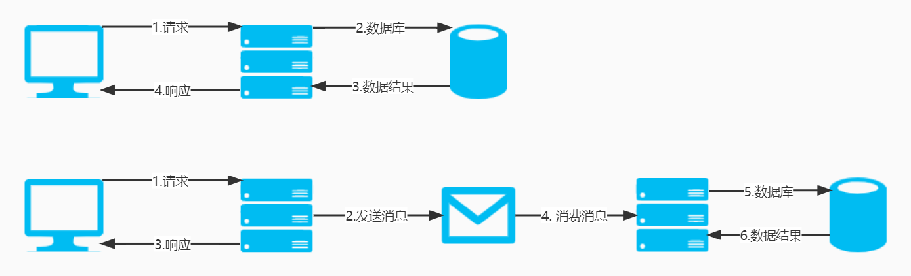

# 基础知识

## 定义

什么是消息队列?从字面意思出发, 将它拆分为**消息**的**队列**

消息, 是服务/系统之间的交互方案

队列, 是一种先进先出的数据结构

消息队列就是用队列结构保存消息的容器或组件, 普遍应用于分布式架构

## 协议与模式

Java开发包含如下两种消息队列协议:

- JMS(**J**ava **M**essage **S**ervice)
- AMQP(**A**dvanced **M**essage **Q**ueuing **P**rotocol)

消息队列有如下两种常见的消息模式:

- 点到点模式
- 发布-订阅模式

### JMS

有五种消息正文格式:

- StreamMessage: 数据流
- MapMessage: Map数据
- TextMessage: 字符串
- ObjectMessage: 序列化的 Java 对象
- BytesMessage: 字节的数据流

### AMQP

AMQP提供统一消息服务的二进制应用层协议, 是一种开放标准, 面向消息队列的中间件设计, 兼容JMS

基于此协议开发的消息队列组件可相互传递消息, 不受产品/开发语言条件的限制

支持五种消息模式:

- direct exchange
- fanout exchange
- topic change
- headers exchange
- system exchange

后四种与发布-订阅模式没有太大区别, 仅在路由机制上做了更详细的划分

### JMS vs AMQP

| 协议     | JMS  |    AMQP     |
| :------- | :--: | :---------: |
| 跨语言   |  ×   |      √      |
| 跨平台   |  ×   |      √      |
| 消息类型 | 5种  | 1种(二进制) |
| 消息模式 | 2种  |     5种     |

## 应用场景

### 异步处理提高系统性能

传统项目, 用户需要等待业务系统执行一系列操作后返回响应, 这个过程容易受到网络波动或服务器压力的影响, 导致响应时间过长或超时

加入消息队列后, 将用户请求写入队列即可返回响应, 并在后续业务处理中进行兜底, 这种模式体验更好, 可靠性也更高

常见的应用场景为**购票系统**

### 削峰/限流

将**短时间高并发的事务消息**存储在队列中, 之后服务端再慢慢消费, 从而避免直接被大量业务请求击垮

常见的应用场景为**秒杀系统**

### 降低系统耦合性

可以使用(但不限于)发布-订阅模式, 将用户请求/业务请求等发送至消息队列

对该内容感兴趣的服务消费此消息, 完成后续处理

当有新的服务加入时, 只需要根据自己的需求对消息进行消费, 对原有系统没有任何影响

## 带来的问题

### 顺序消费

使用消息队列时, 系统中将同时存在多种内容不同的消息, 例如:

1. 用户付款消息
2. 用户积分变动消息

这两个消息所代表的业务是有严格的执行顺序的: 先付款, 后增加积分

所以, 在使用消息队列时应注意部分消息的消费顺序

在[定义](#定义)中我们讲过什么是队列, 可以得出一个结论: 在同一队列中, 消息的顺序是确定的

所以, 保证顺序消费的通用解决策略为: **将同一语义(业务)的消息, 放在同一队列中**

### 重复消费

因网络波动等原因, 可能会造成消息的重复消费

例如: 订单支付消息重复消费, 是否会造成二次扣款?

和接口重复调用类似, 通用的解决策略为: **幂等性处理**

比如扣款服务根据订单唯一主键进行幂等性校验, 第二次扣款请求将会驳回

### 消息丢失

在生产者/消费者/消息服务器等都可能会出现消息丢失的情况

当下没有完美通用的解决策略, 只能通过**主从副本, 快速刷盘, 业务兜底**等方式, 尽量减少消息丢失的可能性

### 消息服务可用性

使用消息队列, 必然会引入消息服务

消息服务的可用性会增加整个系统的设计和运维负担

通用解决策略可参考微服务中的高可用设计, 部分开源方案内部也会尽可能的保证消息服务的正常运转

## 开源方案

- [ActiveMQ](https://activemq.apache.org/)
- [RabbitMQ](https://www.rabbitmq.com/)
- [RocketMQ](https://rocketmq.apache.org/)
- [Kafka](https://kafka.apache.org/)

| 开源方案 |  ActiveMQ  | RabbitMQ | RocketMQ | Kafka  |
| -------- | :--------: | :------: | :------: | :----: |
| 吞吐量   | 万级(最差) |   万级   |  十万级  | 百万级 |
| 可用性   |    主从    |   主从   |  分布式  | 分布式 |
| 时效性   |   毫秒级   |  微秒级  |  毫秒级  | 毫秒级 |
| 消息丢失 |     低     |    低    |    无    |   无   |

当并发量在十万级至百万级时, RabbitMQ是首选

大数据领域和日志采集场景, 适合Kafka, 但Kafka存在如下劣势:

- 重复消费
- topic数量不宜过多

阿里的产品个人认为存在争议, 但它又有中文文档, 需要根据项目成本实际进行考量
