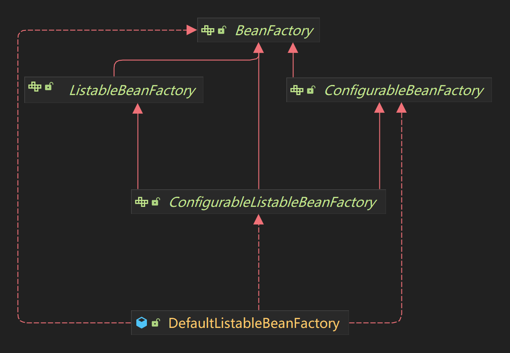

# 控制反转

控制反转(**I**nversion **O**f **C**ontrol), 是Spring的核心之一

它是一种思想, 或者说是设计理念, 并不局限于框架和开发语言

对于控制反转的理解, 我们不应流于形式或字面意思, 而是从系统设计人员的角度进行思考与探索, 如此这般才能切身体会它的精妙与创造力

## 原理

控制反转, 按照中文字面解读, 我们往往会习惯于将重点放在**控制**这个词上, 实际上它的主要内容是**反转**

有人可能会说, 没错, 反转的就是控制权嘛

很可惜, 事实并非如此, 反转的是**获取依赖方式**

开头提到了, 控制反转是一种思想, 我们可以将其理解为Java的接口, 它有两种具体的实现: 依赖查找(**D**ependency **L**ookup)和依赖注入(**D**ependency **I**njection)

看到了吗?它们的开头都是**依赖**

我们以依赖查找为例:

假设现在系统中存在一个IOC容器, 我们用Map模拟即可: `Map<String, Object> context`, 它的key是依赖名称, value是依赖实际内容

创建一个类`A`:

```java
public class A {
}
```

再创建一个需要`A`依赖的`B`:

```java
@AllArgsConstructor
public class B {
  private A a;
}
```

创建`A`的实例, 并把它注册到IOC容器中:

```java
public class IocApplication {
  public static Map<String, Object> context = new HashMap<>();

  public static void main(String[] args) {
    context.put("a", new A());
  }
}
```

接下来创建`B`的实例时, 我们可以直接从IOC容器中找到刚才创建好的`A`实例:

```java
public class IocApplication {
  public static Map<String, Object> context = new HashMap<>();

  public static void main(String[] args) {
    context.put("a", new A());
    context.put("b", new B((A) context.get("a")));
  }
}
```

从IOC容器中查找依赖`A`的过程, 也就是`context.get("a")`, 便是依赖查找

当然, 实际的依赖查找会更加复杂, 例如Spring的依赖查找通常使用`BeanFactory`的`getBean`方法

再来反观传统方式的实例创建:

```java
public class JavaApplication {

  public static void main(String[] args) {
    A a = new A();
    B b = new B(a);
  }
}
```

对比一下这两种方式:

- 传统方式: `B`要求代码提供一个`A`的实例, 依赖获取方式是**主动**的
- 依赖查找: IOC容器查找一个`A`的依赖, 把它赋予`B`, 依赖的保存/获取甚至创建都是由IOC容器完成的, 方式是**被动**的

如果还是不好理解, 我们把`B`改造一下, 变成依赖注入:

```java
public class B {
  // Spring中是@Autowired
  @Resource
  private A a;
}
```

是不是非常明朗了?

所以, 谈及Spring就挂在嘴边的控制反转, 实际是**依赖获取方式的反转**

这里延申一下, 在Spring中我们常使用的控制反转是依赖注入

相较于依赖查找, **依赖注入不需要熟知框架的接口(就是刚才提过的`BeanFactory`的`getBean`), 耦合度更低**

## Spring中的IOC

在Spring中, 控制反转主要由以下内容完成:

- `BeanDefinition`: Bean的定义
- `Bean`: Bean实例
- `BeanFactory`: Bean工厂, 即IOC容器

相较于`BeanFactory`, 更广为人知的是`ApplicationContext`

它其实是`BeanFactory`的拓展, 内部通常组合了`BeanFactory`, 除控制反转外, 还包括Bean生命周期/后置处理器/事件等

如果对事件感兴趣, 可以参考[这篇文章](https://houtaroy.github.io/spring/event/)

下面笔者将对Spring中IOC的相关内容进行简单阐述

其实每个小节都可以展开详细讨论, 如果读者有兴趣, 会在后续更新对应的文章

### BeanDefinition

`BeanDefinition`, 顾名思义, 它就是`Bean`的定义

在Spring的IOC中, Bean可能为各式各样的Class, 它们的类名/构造函数/属性等等均不相同, 所以需要一个统一的描述或定义来确认每个Bean的信息, 这个东西就叫做`BeanDefinition`, 我们也可以把它称为Bean的元信息

它包含的大致信息如下:

- 全限定类名
- 作用域
- 是否延迟加载
- 工厂Bean名称
- 构造方法参数列表
- 属性值

感兴趣的读者可以自己使用IDE查看`BeanDefinition`的构成

### Bean

这里不再对`Bean`有过多赘述, 只简单列举下它的类型和作用域

`Bean`的类型:

- 普通`Bean`: 它是Spring控制反转中最基础的内容, 不过它的基础是上一节的`BeanDefinition`
- 工厂`Bean`: 也就是`FactoryBean`, 它是用来创建普通`Bean`的工厂, 真正涉及业务逻辑的是由它创建的普通`Bean`

`Bean`的作用域:

- Singleton: 单例, 一个 IOC 容器中只有一个
- Prototype: 原型, 每次获取创建一个

**注意: 单例作用域的Bean是线程不安全的, 应是无状态的**

对于Bean的依赖注入, Spring官方推荐使用**构造器注入**, 它拥有下列优点:

- 不可变
- 完全初始化的
- 保证不为null

如果因此导致构造器参数列表过长, 其主要原因是Bean承担的职责过多, 应首先考虑对其进行拆解

### Bean的生命周期

Bean的生命周期分为两个阶段: `BeanDefinition`和Bean实例

`BeanDefinition`:

1. 解析配置(xml或注解)
2. 编程式构造`BeanDefinition`
3. 后置处理

Bean实例:

1. 实例化
2. 属性赋值 + 依赖注入
3. 初始化生命周期回调
4. 实例的销毁

列举几个常用的后置处理器:

- `BeanDefinitionRegistryPostProcessor`: 所有`BeanDefinition`注册完成, 即将加载到`BeanFactory`时的后置处理器, 可用于新增`BeanDefinition`
- `BeanFactoryPostProcessor`: 所有`BeanDefinition`在`BeanFactory`中加载结束的后置处理器, 可用于修改`BeanDefinition`
- `BeanPostProcessor`: `Bean`初始化阶段前后进行干预

### 装配

共有三种装配方式: 模块装配/条件装配/组件扫描

模块装配通常使用自定义的`@EnableXXX`注解 + `@Import`完成, 如果需要自动装配, 可使用Spring的SPI

条件装配分为profile和conditional, 前者基于程序整体层面的多环境配置, 后者基于bean层面, 更加灵活

组件扫描使用`@ComponentScan`注解, 可以指定`includeFilters`和`excludeFilters`来进行过滤

## 番外

### 优雅设计

在Spring的IOC容器设计中, 普遍使用的设计思路是: 父类控制流程 + 子类实现细节, 用到的设计模式为: 模板方法

并且在类的命名上十分清晰, 我们以`DefaultListableBeanFactory`为例, 它的类图如下:



`BeanFactory`有两个子接口`ListableBeanFactory`和`ConfigurableBeanFactory`, 而`ConfigurableListableBeanFactory`则继承了二者

`DefaultListableBeanFactory`实现了`ConfigurableListableBeanFactory`

仔细看看图中五个接口或类的名字, 它们的责任能力, 甚至继承关系都十分明朗, 千万不要小看了命名, 这世间所有优雅都出自名称