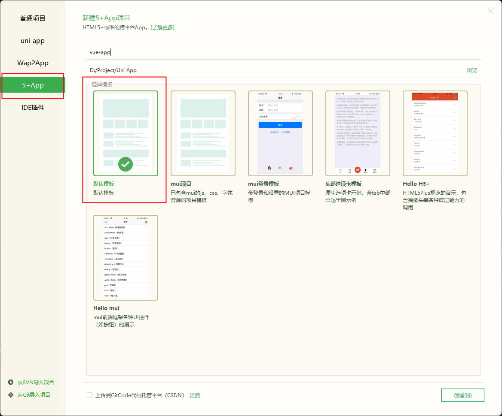
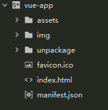

# HTML5打包App

## 新建项目

下载安装[HBuilderX](https://www.dcloud.io/hbuilderx.html), 后续内容基于版本: 3.4.7.20220422

创建5+App的默认模板项目:

创建成功后, 删除`unpackage`和`manifest.json`以外的文件

## 拷贝静态文件

以Vite创建的Vue3项目为例, 将编译后`dist`目录下的内容全部拷贝至项目根目录

拷贝完成后目录如下:

## 打包配置

可以使用HBuilderX提供的图形化界面或直接编码调整打包配置文件`manifest.json`

配置参考官方文档: [完整 manifest.json | uni-app官网 (dcloud.io)](https://uniapp.dcloud.io/tutorial/app-manifest.html)

## 云打包

完成后依据需要进行云打包:

云打包需要排队, 请耐心等待, 打包成功后会自动输出到`/unpackage/release/apk/`目录